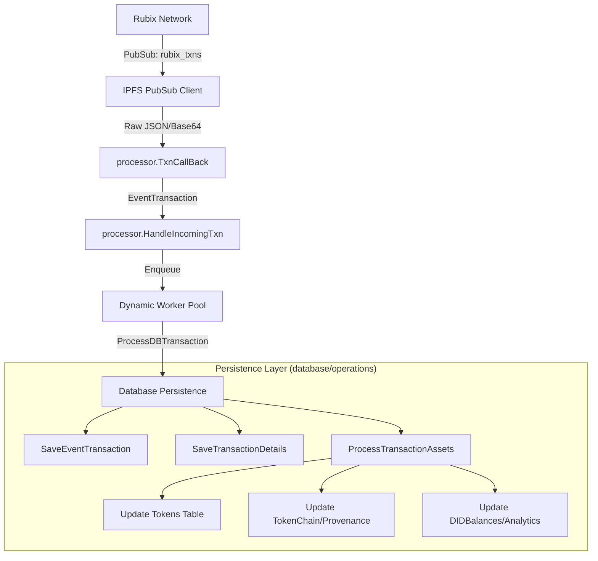

# Rubix Decentralized Explorer Backend

This repository contains the backend server for the [Rubix Network](https://rubix.net/) decentralized explorer [Rubix Explorer](https://explorer.rubix.net/). It tracks DIDs, tokens, and real-time network transactions.

## Architecture & Features

- **Real-Time Data**: Integrates an IPFS node to subscribe to the `rubix_txns` PubSub topic for live transactions updates.
- **Dynamic Processing**: Utilizes a highly concurrent processor that dynamically scales worker count based on system load.
- **RESTful API**: Exposes endpoints for real-time network statistics (total tokens, DIDs, SCs), specific token/transaction retrieval, and DID holding balances.

## System Data Flow & Persistence

The explorer operates as a real-time reactive system, processing high volumes of decentralized network events through a highly concurrent pipeline.

### 1. High-Level Data Flow



### 2. Processing Stages

#### Ingestion & Orchestration
- **PubSub Ingestion**: The server subscribes to the `rubix_txns` topic. Incoming messages are decoded (Base64/JSON) and unmarshaled into the `EventTransaction` model.
- **Validation**: `HandleIncomingTxn` performs strict regex-based validation on all DIDs and TokenIDs before any database interaction occurs.
- **Dynamic Worker Pool**: Validated transactions are enqueued into a worker pool that dynamically scales based on the current workload, ensuring the system remains responsive during traffic spikes.

#### Database Persistence (Persistence Logic)
- **Atomic Transactions**: All asset updates (Tokens, Provenance, and Balances) are performed within a single database transaction to ensure data integrity.
- **Flattening**: The complex, nested transaction payload is simplified into a flattened `TransactionInfo` structure for fast frontend filtering and search.
- **Provenance Handling**: The `TokenChain` and `TokenChainArray` tables work together to maintain a logically sequenced history of every token's movement across the network.
- **Real-Time Analytics**: The `DIDBalances` table is updated incrementally (increments/decrements) during each transaction, allowing for instant "Top Holders" lookups without expensive full-table scans.


## Running the Server

Configure your `.env` (see `.env.example`).

### Development (`go run`)

**MainNet (Default)**
```bash
go run .
```

**TestNet**
```bash
go run . -testnet
```

**Custom Network (Private)**
```bash
go run . -swarmkey config/custom_swarm.key
```

### Production (`go build`)

Build the executable first:
```bash
go build -o explorer.exe .
```

**MainNet (Default)**
```bash
./explorer.exe
```

**TestNet**
```bash
./explorer.exe -testnet
```

**Custom Network (Private)**
```bash
./explorer.exe -swarmkey config/custom_swarm.key
```

## API Reference

All requests follow standard REST principles. Pagination parameters `limit` (default 10) and `page` (default 1) are supported on list endpoints.

### 1. Unified Search

- **`GET /api/get-info?id=<string>`**
  - **Description**: Routes queries based on format (DID, Token, or Transaction).
  - **Input**: `id` - DID, TokenID, or TransactionID.
  - **Output Example (DID)**:
    ```json
    {
      "type": "DID",
      "data": [
        {
          "did": "bafybm...",
          "asset_type": "RBT",
          "token_name": "RBT",
          "balance": 10.5,
          "last_update": 1679567400
        }
      ]
    }
    ```

### 2. Network Statistics (Counts)
- **`GET /api/get-rbt-count`** -> `{ "all_rbt_count": 1250 }`
- **`GET /api/get-ft-count`** -> `{ "all_ft_count": 5400 }`
- **`GET /api/get-nft-count`** -> `{ "all_nft_count": 320 }`
- **`GET /api/get-sc-count`** -> `{ "all_sc_count": 45 }`
- **`GET /api/get-txn-count`** -> `{ "all_transaction_count": 89000 }`
- **`GET /api/get-did-count`** -> `{ "all_did_count": 1200 }`

### 3. Lists and Holders

- **`GET /api/dagtxn/{txnID}?depth=<n>`**
  - **Description**: Returns an anchor transaction and all of its ancestors up to `depth` levels back, traversing the token chain DAG via `previous_transaction_id` links. Returns nodes (full `TransactionInfo`) and directed edges (`from` → `to`, child → parent).
  - **Path Param**: `txnID` — the transaction to start from.
  - **Query Param**: `depth` (optional) — how many hops back to traverse (default/max `100`).
  - **Infinite Scroll**: When the user scrolls to the bottom of the visible DAG, take the oldest transaction currently visible and call `GET /api/dagtxn/{oldestTxnID}`. Merge the new nodes and edges into the existing graph.
  - **Example**: `GET /api/dagtxn/Qmabc123...?depth=100`
  - **Output Example**:
    ```json
    {
      "transactions": [
        { "transaction_id": "Qmabc...", "initiator": "bafybm...", "epoch": 1710234567, "tokens": {...} },
        { "transaction_id": "Qmxyz...", "initiator": "bafybm...", "epoch": 1710234500, "tokens": {...} }
      ],
      "edges": [
        { "from": "Qmabc...", "to": "Qmxyz..." }
      ]
    }
    ```

- **`GET /api/dagtxns`**
  - **Description**: Returns the latest 1000 transactions ordered by epoch descending. No parameters required.
  - **Output Example**:
    ```json
    [
      {
        "transaction_id": "Qm...",
        "initiator": "bafybm...",
        "owner": "bafybm...",
        "epoch": 1679567400,
        "tokens": { "rbt": [...] },
        "memo": "Payment for services"
      }
    ]
    ```

- **`GET /api/get-latest-transactions?limit=2`**
  - **Output Example**:
    ```json
    [
      {
        "transaction_id": "Qm...",
        "initiator": "bafybm...",
        "owner": "bafybm...",
        "epoch": 1679567400,
        "tokens": { "rbt": [...] },
        "memo": "Payment for services"
      }
    ]
    ```

- **`GET /api/get-did-with-most-rbts?limit=2`**
  - **Output Example**:
    ```json
    [
      {
        "did": "bafybm...",
        "balance": 500.75,
        "last_update": 1679567400
      }
    ]
    ```

- **`GET /api/get-rbt-list?limit=2`**
  - **Output Example**:
    ```json
    [
      {
        "token_id": "Qm...",
        "token_value": 1.0,
        "did": "bafybm...",
        "token_status": 1
      }
    ]
    ```

- **`GET /api/search-rbt-suggestions?query=<prefix>&limit=<n>`**
  - **Description**: Autocomplete suggestions for RBT token IDs. Returns token IDs that start with the given prefix.
  - **Query Params**:
    - `query` (required) — prefix to match against token IDs.
    - `limit` (optional) — max results to return (default `10`, max `20`).
  - **Example**: `GET /api/search-rbt-suggestions?query=123&limit=5`
  - **Output Example**:
    ```json
    [
      { "token_id": "123_1" },
      { "token_id": "123_2" },
      { "token_id": "1234_1" }
    ]
    ```

- **`GET /api/get-rbt-info?tokenId=<id>`**
  - **Description**: Returns owner and value details for a single RBT token. Used to populate the detail card when a user selects an RBT suggestion.
  - **Query Params**:
    - `tokenId` (required) — full RBT token ID.
  - **Example**: `GET /api/get-rbt-info?tokenId=123_1`
  - **Output Example**:
    ```json
    {
      "token_id": "123_1",
      "owner_did": "bafybmeiowner...",
      "token_value": 1.0
    }
    ```

- **`GET /api/get-ft-group-list`**
  - **Output Example**:
    ```json
    [
      {
        "ftName": "RubixPoints",
        "count": 1000,
        "creatorDID": "bafybm..."
      }
    ]
    ```

- **`GET /api/search-ft-suggestions?query=<prefix>&limit=<n>`**
  - **Description**: Autocomplete endpoint for FT name search. Returns distinct `(ft_name, creator_did)` pairs where the FT name starts with the given prefix (case-insensitive). Useful for building search-as-you-type dropdowns — multiple results can share the same name but have different creator DIDs.
  - **Query Params**:
    - `query` (required) — prefix to match against FT names.
    - `limit` (optional) — max results to return (default `10`, max `20`).
  - **Example**: `GET /api/search-ft-suggestions?query=rub&limit=5`
  - **Output Example**:
    ```json
    [
      {
        "ft_name": "RubixPoints",
        "creator_did": "bafybmeibnbqcgqnhobznoqmhmdqd..."
      },
      {
        "ft_name": "RubixRewards",
        "creator_did": "bafybmeiaaabbbcccdddeeefffggg..."
      }
    ]
    ```

- **`GET /api/get-ft-list-by-ftname?ftName=RubixPoints`**
  - **Output**: List of individual FT tokens matching the name.

- **`GET /api/get-ft-info?ftName=<name>&creatorDID=<did>`**
  - **Description**: Returns aggregate details for a specific FT, uniquely identified by its name and creator DID. Used to populate the detail card when a user selects an FT suggestion.
  - **Query Params**:
    - `ftName` (required) — exact FT name.
    - `creatorDID` (required) — creator's DID.
  - **Example**: `GET /api/get-ft-info?ftName=RubixPoints&creatorDID=bafybmeibnbqcgqnhobznoqmhmdqd...`
  - **Output Example**:
    ```json
    {
      "ft_name": "RubixPoints",
      "creator_did": "bafybmeibnbqcgqnhobznoqmhmdqd...",
      "ft_value": 1.0,
      "total_amount": 10000,
      "created_time": 1710234567
    }
    ```

- **`GET /api/get-ft-top-holders?ftName=<name>&creatorDID=<did>&limit=<n>&page=<n>`**
  - **Description**: Returns the top holders of a specific FT (identified by its name + creator DID), ranked by token count in descending order. Supports pagination.
  - **Query Params**:
    - `ftName` (required) — exact FT name (e.g. `RubixPoints`).
    - `creatorDID` (required) — creator DID of the FT (e.g. `bafybm...`).
    - `limit` (optional) — results per page (default `10`).
    - `page` (optional) — page number (default `1`).
  - **Example**: `GET /api/get-ft-top-holders?ftName=RubixPoints&creatorDID=bafybmeibnbqcgqnhobznoqmhmdqd...&limit=5&page=1`
  - **Output Example**:
    ```json
    {
      "holders": [
        { "did": "bafybmeiaaabbbcccdddeeefffggg...", "token_count": 500 },
        { "did": "bafybmeihhhjjjkkkllllmmmnnnooo...", "token_count": 320 }
      ],
      "total_count": 87,
      "page": 1,
      "limit": 5
    }
    ```

- **`GET /api/get-sc-list`**
  - **Output**: List of Smart Contract tokens (`token_type: 4`).

### 4. Details and History

- **`GET /api/get-transaction-info?transactionID=<id>`**
  - **Output Example**:
    ```json
    {
      "transaction_id": "Qm...",
      "initiator": "bafybm...",
      "owner": "bafybm...",
      "epoch": 1679567400,
      "quorums": [...],
      "memo": "Initial mint"
    }
    ```

- **`GET /api/get-token-info?tokenID=<id>`**
  - **Output Example**:
    ```json
    {
      "token_id": "Qm...",
      "token_value": 1.0,
      "did": "bafybm...",
      "token_status": 1,
      "token_type": 1
    }
    ```

- **`GET /api/get-transaction-info-list?tokenID=<id>`**
  - **Description**: Returns the full transaction history for a specific token.
  
- **`GET /api/get-transaction-id-list?tokenID=<id>`**
  - **Output Example**:
    ```json
    [
      {
        "id": 1,
        "token_id": "Qm...",
        "transaction_id": "txn_123",
        "previous_transaction_id": ""
      }
    ]
    ```
