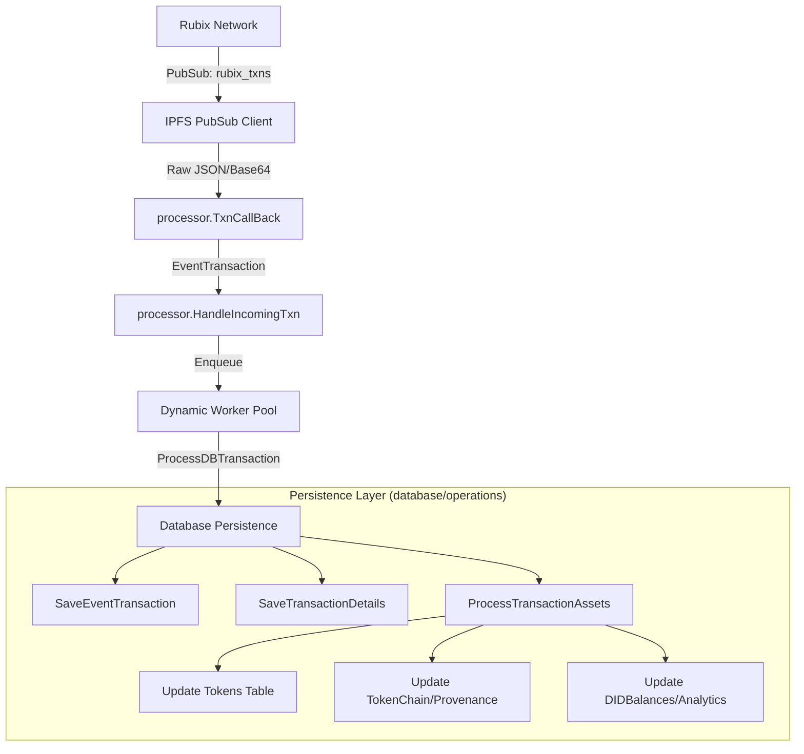

# Rubix Decentralized Explorer Backend

This repository contains the backend server for the [Rubix Network](https://rubix.net/) decentralized explorer [Rubix Explorer](https://explorer.rubix.net/). It tracks DIDs, tokens, and real-time network transactions.

## Architecture & Features

- **Real-Time Data**: Integrates an IPFS node to subscribe to the `rubix_txns` PubSub topic for live transactions updates.
- **Dynamic Processing**: Utilizes a highly concurrent processor that dynamically scales worker count based on system load.
- **RESTful API**: Exposes endpoints for real-time network statistics (total tokens, DIDs, SCs), specific token/transaction retrieval, and DID holding balances.

## System Data Flow & Persistence

The explorer operates as a real-time reactive system, processing high volumes of decentralized network events through a highly concurrent pipeline.

### 1. High-Level Data Flow



### 2. Processing Stages

#### Ingestion & Orchestration
- **PubSub Ingestion**: The server subscribes to the `rubix_txns` topic. Incoming messages are decoded (Base64/JSON) and unmarshaled into the `EventTransaction` model.
- **Validation**: `HandleIncomingTxn` performs strict regex-based validation on all DIDs and TokenIDs before any database interaction occurs.
- **Dynamic Worker Pool**: Validated transactions are enqueued into a worker pool that dynamically scales based on the current workload, ensuring the system remains responsive during traffic spikes.

#### Database Persistence (Persistence Logic)
- **Atomic Transactions**: All asset updates (Tokens, Provenance, and Balances) are performed within a single database transaction to ensure data integrity.
- **Flattening**: The complex, nested transaction payload is simplified into a flattened `TransactionInfo` structure for fast frontend filtering and search.
- **Provenance Handling**: The `TokenChain` and `TokenChainArray` tables work together to maintain a logically sequenced history of every token's movement across the network.
- **Real-Time Analytics**: The `DIDBalances` table is updated incrementally (increments/decrements) during each transaction, allowing for instant "Top Holders" lookups without expensive full-table scans.


## Running the Server

Configure your `.env` (see `.env.example`).

### Development (`go run`)

**MainNet (Default)**
```bash
go run .
```

**TestNet**
```bash
go run . -testnet
```

**Custom Network (Private)**
```bash
go run . -swarmkey config/custom_swarm.key
```

### Production (`go build`)

Build the executable first:
```bash
go build -o explorer.exe .
```

**MainNet (Default)**
```bash
./explorer.exe
```

**TestNet**
```bash
./explorer.exe -testnet
```

**Custom Network (Private)**
```bash
./explorer.exe -swarmkey config/custom_swarm.key
```

## API Reference

All requests follow standard REST principles. Pagination parameters `limit` (default 10) and `page` (default 1) are supported on all list endpoints.

### 1. Unified Search

- **`GET /api/get-info?id=<id>`**
  - **Input Sample (DID)**: `/api/get-info?id=bafybm...`
  - **Input Sample (Token)**: `/api/get-info?id=Qm...`
  - **Input Sample (Transaction)**: `/api/get-info?id=txn_...` (or IPFS hash)
  - **Parameters**: `id` (string, required)
  - **Response Model**: `api.SearchResult` (polymorphic)

### 2. Network Statistics (Counts)

All count APIs take **no inputs** and return a JSON object with a single key-value pair.

- **`GET /api/get-rbt-count`** -> `{"all_rbt_count": 1250}`
- **`GET /api/get-ft-count`** -> `{"all_ft_count": 5400}`
- **`GET /api/get-nft-count`** -> `{"all_nft_count": 320}`
- **`GET /api/get-sc-count`** -> `{"all_sc_count": 45}`
- **`GET /api/get-txn-count`** -> `{"all_transaction_count": 89000}`
- **`GET /api/get-did-count`** -> `{"all_did_count": 1200}`

### 3. Lists and Holders

List endpoints return a plain JSON array of objects. All support `limit` and `page` query parameters. Returns an empty array `[]` if no records found.

- **`GET /api/get-latest-transactions`**
  - **Input Sample**: `/api/get-latest-transactions?limit=10&page=1`
  - **Response Model**: `[]models.TransactionInfo`
  - **Fields**: `transaction_id`, `initiator`, `owner`, `epoch`, `network`, `tokens`, `committedTokens`, `quorums`, `memo`, `created_at`.

- **`GET /api/get-did-with-most-rbts`**
  - **Input Sample**: `/api/get-did-with-most-rbts?limit=5`
  - **Response Model**: `[]models.DIDBalance`
  - **Fields**: `did`, `asset_type`, `token_name`, `balance`, `last_update`.

- **`GET /api/get-rbt-list`**, **`GET /api/get-nft-list`**, **`GET /api/get-sc-list`**
  - **Input Sample**: `/api/get-rbt-list?limit=10`
  - **Response Model**: `[]models.Token`
  - **Fields**: `token_id`, `parent_token_id`, `token_value`, `token_status`, `did`, `transaction_id`, `token_type`, `data`, `created_at`, `updated_at`.

- **`GET /api/get-ft-group-list`**
  - **Input Sample**: `/api/get-ft-group-list`
  - **Response Model**: `[]model.FTGroup`
  - **Fields**: `ftName`, `count`, `creatorDID`.

### 4. Details and History

- **`GET /api/get-transaction-info?transactionID=<id>`**
  - **Input Sample**: `/api/get-transaction-info?transactionID=txn_123`
  - **Response Model**: `models.TransactionInfo`

- **`GET /api/get-token-info?tokenID=<id>`**
  - **Input Sample**: `/api/get-token-info?tokenID=Qm...`
  - **Response Model**: `models.Token`

- **`GET /api/get-transaction-info-list?tokenID=<id>`**
  - **Input Sample**: `/api/get-transaction-info-list?tokenID=Qm...&limit=5`
  - **Response Model**: `[]models.TransactionInfo`

- **`GET /api/get-transaction-id-list?tokenID=<id>`**
  - **Input Sample**: `/api/get-transaction-id-list?tokenID=Qm...`
  - **Response Model**: `[]models.TokenChain`
  - **Fields**: `id`, `token_id`, `transaction_id`, `role`, `previous_transaction_id`, `created_at`.
