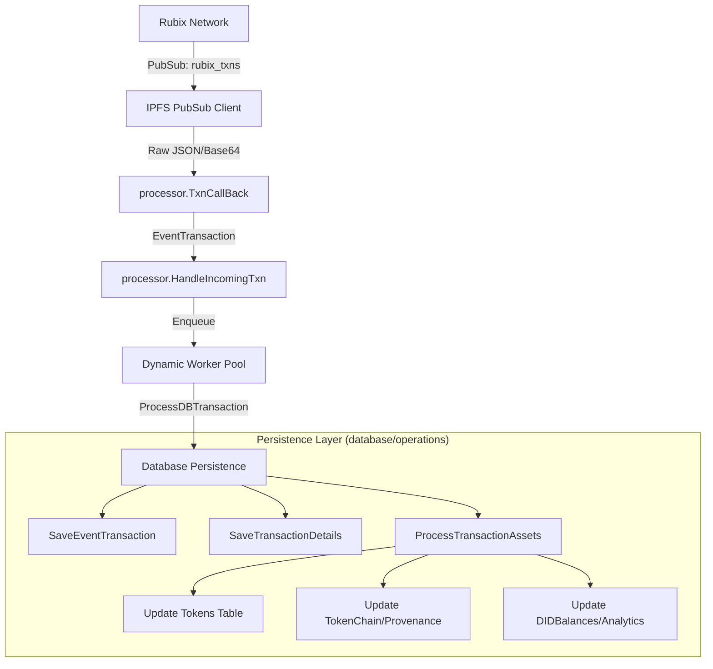

# Rubix Decentralized Explorer Backend

This repository contains the backend server for the [Rubix Network](https://rubix.net/) decentralized explorer [Rubix Explorer](https://explorer.rubix.net/). It tracks DIDs, tokens, and real-time network transactions.

## Architecture & Features

- **Real-Time Data**: Integrates an IPFS node to subscribe to the `rubix_txns` PubSub topic for live transactions updates.
- **Dynamic Processing**: Utilizes a highly concurrent processor that dynamically scales worker count based on system load.
- **RESTful API**: Exposes endpoints for real-time network statistics (total tokens, DIDs, SCs), specific token/transaction retrieval, and DID holding balances.

## System Data Flow & Persistence

The explorer operates as a real-time reactive system, processing high volumes of decentralized network events through a highly concurrent pipeline.

### 1. High-Level Data Flow



### 2. Processing Stages

#### Ingestion & Orchestration
- **PubSub Ingestion**: The server subscribes to the `rubix_txns` topic. Incoming messages are decoded (Base64/JSON) and unmarshaled into the `EventTransaction` model.
- **Validation**: `HandleIncomingTxn` performs strict regex-based validation on all DIDs and TokenIDs before any database interaction occurs.
- **Dynamic Worker Pool**: Validated transactions are enqueued into a worker pool that dynamically scales based on the current workload, ensuring the system remains responsive during traffic spikes.

#### Database Persistence (Persistence Logic)
- **Atomic Transactions**: All asset updates (Tokens, Provenance, and Balances) are performed within a single database transaction to ensure data integrity.
- **Flattening**: The complex, nested transaction payload is simplified into a flattened `TransactionInfo` structure for fast frontend filtering and search.
- **Provenance Handling**: The `TokenChain` and `TokenChainArray` tables work together to maintain a logically sequenced history of every token's movement across the network.
- **Real-Time Analytics**: The `DIDBalances` table is updated incrementally (increments/decrements) during each transaction, allowing for instant "Top Holders" lookups without expensive full-table scans.


## Running the Server

Configure your `.env` (see `.env.example`).

### Development (`go run`)

**MainNet (Default)**
```bash
go run .
```

**TestNet**
```bash
go run . -testnet
```

**Custom Network (Private)**
```bash
go run . -swarmkey config/custom_swarm.key
```

### Production (`go build`)

Build the executable first:
```bash
go build -o explorer.exe .
```

**MainNet (Default)**
```bash
./explorer.exe
```

**TestNet**
```bash
./explorer.exe -testnet
```

**Custom Network (Private)**
```bash
./explorer.exe -swarmkey config/custom_swarm.key
```

## API Reference

All requests follow standard REST principles. Pagination parameters `limit` (default 10) and `page` (default 1) are supported on all list endpoints.

### 1. Unified Search

- **`GET /api/get-info?id=<string>`**
  - **Input**: `id` - DID (starts with `bafybm`), TokenID (`Qm...`), or TransactionID.
  - **Output Example (DID Search)**:
    ```json
    {
      "type": "DID",
      "data": [
        {
          "did": "bafybm...",
          "asset_type": "RBT",
          "token_name": "RBT",
          "balance": 150.0,
          "last_update": 1679567400
        }
      ]
    }
    ```

### 2. Network Statistics (Counts)
- **`GET /api/get-rbt-count`** -> `{ "all_rbt_count": 1250 }`
- **`GET /api/get-ft-count`** -> `{ "all_ft_count": 5400 }`
- **`GET /api/get-nft-count`** -> `{ "all_nft_count": 320 }`
- **`GET /api/get-sc-count`** -> `{ "all_sc_count": 45 }`
- **`GET /api/get-txn-count`** -> `{ "all_transaction_count": 89000 }`
- **`GET /api/get-did-count`** -> `{ "all_did_count": 1200 }`

### 3. Lists and Holders

List endpoints return a plain JSON array of objects.

- **`GET /api/get-latest-transactions?limit=10&page=1`**
  - **Output Example**:
    ```json
    [
      {
        "transaction_id": "Qm...",
        "initiator": "bafybm...",
        "owner": "bafybm...",
        "epoch": 1679567400,
        "network": "rubix",
        "tokens": { "rbt": [{"tokenId": "Qm...", "previousTransactionID": "", "data": ""}] },
        "committedTokens": [],
        "quorums": [],
        "memo": "Initial mint",
        "created_at": "2023-03-23T10:00:00Z"
      },
      {
        "transaction_id": "Qm...",
        "initiator": "bafybm...",
        "owner": "bafybm...",
        "epoch": 1679567450,
        "network": "rubix",
        "tokens": { "rbt": [{"tokenId": "Qm...", "previousTransactionID": "Qm...", "data": ""}] },
        "committedTokens": [],
        "quorums": [],
        "memo": "Transfer",
        "created_at": "2023-03-23T10:00:50Z"
      }
    ]
    ```

- **`GET /api/get-did-with-most-rbts?limit=10`**
  - **Output Example**:
    ```json
    [
      {
        "did": "bafybm...",
        "asset_type": "RBT",
        "token_name": "RBT",
        "balance": 5000.0,
        "last_update": 1679567400
      },
      {
        "did": "bafybm...",
        "asset_type": "RBT",
        "token_name": "RBT",
        "balance": 2500.5,
        "last_update": 1679567500
      }
    ]
    ```

- **`GET /api/get-rbt-list`**, **`GET /api/get-nft-list`**, **`GET /api/get-sc-list`**
  - **Output Example**:
    ```json
    [
      {
        "token_id": "Qm...",
        "parent_token_id": "",
        "token_value": 1.0,
        "token_status": 1,
        "did": "bafybm...",
        "transaction_id": "txn_123",
        "token_type": 1,
        "data": "",
        "created_at": "2023-03-23T10:00:00Z",
        "updated_at": "2023-03-23T10:00:00Z"
      }
    ]
    ```

- **`GET /api/get-ft-group-list`**
  - **Output Example**:
    ```json
    [
      {
        "ftName": "RubixPoints",
        "count": 1200,
        "creatorDID": "bafybm..."
      },
      {
        "ftName": "LoyaltyToken",
        "count": 450,
        "creatorDID": "bafybm..."
      }
    ]
    ```

### 4. Details and History

- **`GET /api/get-transaction-info?transactionID=<id>`**
  - **Output**: Single `TransactionInfo` object (see list example above for schema).

- **`GET /api/get-token-info?tokenID=<id>`**
  - **Output**: Single `Token` object (see list example above for schema).

- **`GET /api/get-transaction-info-list?tokenID=<id>`**
  - **Output**: Array of `TransactionInfo` objects.

- **`GET /api/get-transaction-id-list?tokenID=<id>`**
  - **Output Example**:
    ```json
    [
      {
        "id": 145,
        "token_id": "Qm...",
        "transaction_id": "txn_abc",
        "role": 0,
        "previous_transaction_id": "txn_prev",
        "created_at": "2023-03-23T10:00:00Z",
        "updated_at": "2023-03-23T10:00:00Z"
      },
      {
        "id": 142,
        "token_id": "Qm...",
        "transaction_id": "txn_prev",
        "role": 0,
        "previous_transaction_id": "txn_orig",
        "created_at": "2023-03-23T09:00:00Z",
        "updated_at": "2023-03-23T09:00:00Z"
      }
    ]
    ```
